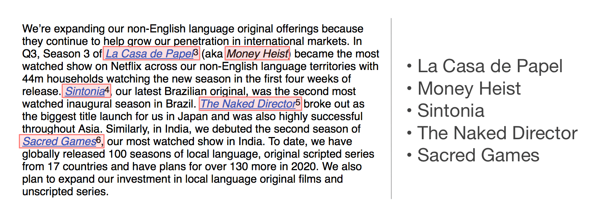

## What is this?
This repository has code I wrote to extract names of TV shows and movies from the quarterly Netflix _Letter to the shareholders_.

For more details about my motivation and explanation of the code, please see my [blog post](https://deepakg.github.io/nlp,/python,/html/parsing/2019/11/01/netflix-shows.html).

## What do I need to run this code?

- Python 3.6
- requests_html
- spaCy (if you'd like to try the NLP version)
- The pre-trained en_core_web_lg model (you can install it using `python -m spacy download en_core_web_lg` after installing spaCy.

## Anything else?
The `generate_html.py` file uses functions defined in `show_extractor.py` to generate an html file with all the shows sorted by years and quarters. It outputs the html to stdout so you need to redirect it to a file to be able to open it in a browser.

The `data/` directory has a copy of the actual letters to the shareholders that I saved from sec.gov.

